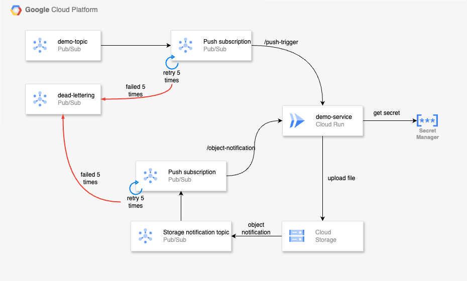

# Demo Service 

## Description
This project is a demo service built with TypeScript, intended to be deployed as a **Cloud Run** service. It utilizes various Google Cloud services such as Pub/Sub, Secret Manager, and Storage, and uses Terraform for resource management and deployment.<br>
The project is designed to be straightforward, demonstrating how to deploy a service and manage infrastructure with Terraform, while also showcasing interactions with various Google Cloud services. <br> <br>The focus is on the ease of managing infrastructure with Terraform, illustrating how simple it is to:

- Migrate to new environments
- Set up staging environments identical to production for testing
- Scale resources based on demand
- Maintain and update infrastructure with minimal downtime
- Ensure consistency and reproducibility across different environments


## Prerequisites
- Node.js (>=18)
- npm
- terraform (=v1.5.7)

## Project Structure
- **`src/`**: Source code for the cloud run service.
- **`build/`**: Compiled JavaScript files.
- **`terraform/`**: Terraform configuration files.<br>


  Terraform is set up in this project to manage all the resources, as well as to build, push, and deploy the image to Cloud Run.
  Once you complete the configuration described below in the **Deployment** section, running the Terraform commands will get the service and resources up and running.<br>


**IMPORTANT NOTE:** When you are done, please run the following command to destroy all the created resources and avoid any extra charges:
``` terraform destroy -var-file="environments/dev/terraform.tfvars" -no-color```


## Terraform

All Terraform resources are named with a prefix defined in the **terraform.tfvars** file to avoid naming conflicts when multiple users try this service. As a first step, please change this prefix to something unique to you.

### Configuration
The project uses Terraform for infrastructure management, with configuration files located in the terraform/environments directory. Since this project only has one environment, there is only the **dev** folder.<br>

The configuration files for each environment include:
#### terraform.tfvars file:

This file contains global variables used throughout the project, including the project ID, region, and other details about the service to be deployed.


###### important variables in the terraform.tfvars file:
- **version**: Changing the version in the **terraform.tfvars** file  informs Terraform that a new version of the Cloud Run service (located in the /src directory) should be deployed. <br>
  **Note**: Only update the version number when changes are made in the **/src** directory, not for infrastructure-only changes.
- **prefix**:  This is used to prefix all resources created by Terraform to avoid naming conflicts when multiple users try this service.


#### backend.conf file:
This file contains the configuration for the Terraform backend and is used to store the state file in a Google Cloud Storage bucket.

Since all resources are named with a prefix, conflicts are avoided. Changing the bucket configuration to work with your own state is optional.


### Deployment 
After making the necessary changes, to deploy the service and infrastructure, follow these steps:

1. Change the **prefix** in the **terraform.tfvars** file to something unique to you. This is a one-time change when you first get started.
2. If the service code in /src is changed, update the version number in both the **terraform.tfvars** file and **package.json** to reflect the new version. -- if not changed the run service will not be redeployed.

3. Connect to the Google Cloud project by running the following commands -- 3 & 4 are optional if you have already authenticated:
    ```sh
     gcloud auth application-default login --project=curamet-onboarding
     gcloud config set project curamet-onboarding
     gcloud auth login
    ```
4. Authenticate with the artifact registry:
    ```sh
    gcloud auth configure-docker "europe-docker.pkg.dev"
    ```
   
5. Initialize Terraform -- from this point on, navigate to the **terraform** directory: 
    ```sh
    terraform init --backend-config="environments/dev/backend.conf"
    ```

6. Plan the Terraform configuration to make sure all looks good:
    ```sh
   terraform plan -var-file="environments/dev/terraform.tfvars" -no-color
    ```
   
7. Apply the Terraform configuration:
    ```sh
    terraform apply -var-file="environments/dev/terraform.tfvars" -no-color
    ```


## Service

The source code for the service is located in **/src**, it has the following available endpoints:

1. **POST**: `/push-trigger`
    - **Description**: This endpoint is triggered by a Pub/Sub push subscription. It retrieves data from the Secret Manager and uploads a dummy file to a storage bucket, which in turn triggers the next endpoint via a storage object notification.
    - **Method**: POST

2. **POST**: `/object-notification`
    - **Description**: This endpoint is triggered by a storage object notification when a file is uploaded to the bucket.
    - **Method**: POST
    - **Request Parameters**: the attributes that are sent to the endpoint by the storage notification are detailed here https://cloud.google.com/storage/docs/pubsub-notifications


## Deployed Infrastructure / Resources
This is a high level overview of the resources created by Terraform after a successful deployment:

<br>



## Suggested Next Steps

- [ ] Set up a CI/CD pipeline with Cloud Build.
- [ ] Set up a CI/CD pipeline  with GitHub Actions.
- [ ] Implement pull subscription.
- [ ] Showcase a scenario where the push trigger fails 5 times and is sent to a dead-letter topic.
- [ ] Improve the way versioning is managed (currently, the version has to be manually updated in the **terraform.tfvars** file).
- [ ] Add lifecycle rules to the storage bucket.
- [ ] Restrict the service account (demo service runner) to access only the specified secret rather than all secrets.
- [ ] Create a Cloud Scheduler job with Terraform to trigger an existing or a new endpoint. 
- [ ] Use an alternative way to retrieve the secret from Secret Manager (instead of using the Secret Manager client library).
- [ ] Setup a vpc network for the cloud run service to improve security.
- [ ] Enable Cloud Run invocations from only specific IP addresses.
- [ ] Anything worth exploring or trying. 
